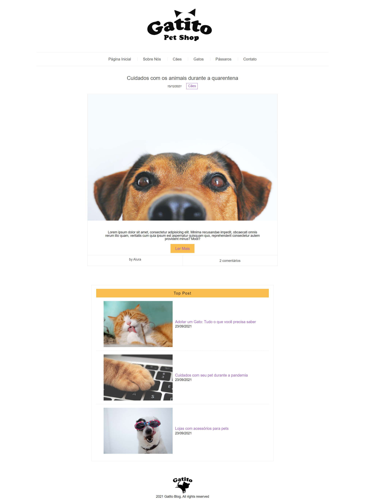

# Alura || Gatito-Shop  || <a href="https://carlosvinicius-ai.github.io/AluraCurso-Front-End/Gatito-Shop/">Clique Aqui</a>

## Technologies Used 🧩

*      

> É um site desenvolvido para melhor entendimento da utilização da tecnologia SASS e entender como funciona as variaveis, mixin, function, each, import e while dentro do SASS e sua importância para facilitar o processo de desenvolvimento do site

Feito com **💜** por <a href="https://www.linkedin.com/in/carlosvini/">Carlos Vinícius</a>