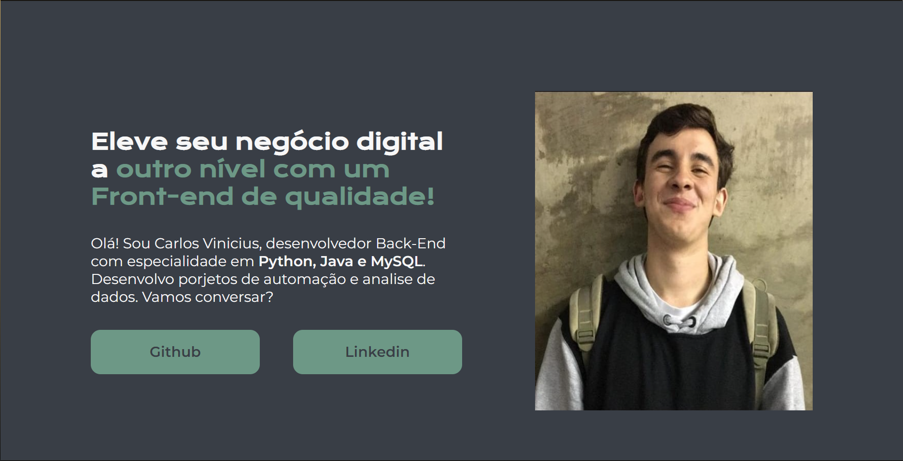
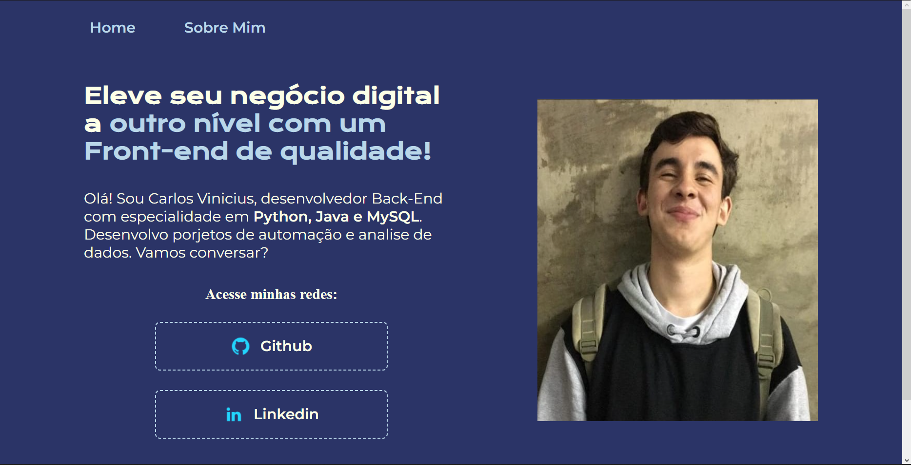

# **🚀Projetos Portfolio**

Reposit[orio cirado para desenvolvimento de um projeto feito durante a formação Iniciante em Programação, onde procuro desenvolver cada dia mais minha lógica de programação e o raciocínio

## **HTML e CSS: ambientes de desenvolvimento, estrutura de arquivos e tags**

- [HTML e CSS: ambientes de desenvolvimento, estrutura de arquivos e tags](https://github.com/carlosvinicius-ai/AluraCurso-Front-End/tree/master/ProjetoPortfolio/HTML%20e%20CSS%20ambientes%20de%20desenvolvimento%20estrutura%20de%20arquivos%20e%20tags)
- [Site](https://carlosvinicius-ai.github.io/AluraCurso-Front-End/ProjetoPortfolio/HTML%20e%20CSS%20ambientes%20de%20desenvolvimento%20estrutura%20de%20arquivos%20e%20tags/)

Primeira parte do desenvolvimento, onde entendi mais sobre as utilização de tags semânticas e padronização de processos

## **HTML e CSS: Classes, posicionamento e Flexbox**

- [HTML e CSS: Classes, posicionamento e Flexbox](https://github.com/carlosvinicius-ai/AluraCurso-Front-End/tree/master/ProjetoPortfolio/HTML_CSS-Classes_Flexbox)
- [Site](https://carlosvinicius-ai.github.io/AluraCurso-Front-End/ProjetoPortfolio/HTML_CSS-Classes_Flexbox/)

Segunda parte do desenvolvimento do site, onde recordei sobre o Flexbox e sobre como posicionar as classes dentro do projeto

## **HTML e CSS: cabeçalho, footer e variáveis CSS**

- [HTML e CSS: cabeçalho, footer e variáveis CSS](https://github.com/carlosvinicius-ai/AluraCurso-Front-End/tree/master/ProjetoPortfolio/HTML_CSS-variaveis)
- [Site](https://carlosvinicius-ai.github.io/AluraCurso-Front-End/ProjetoPortfolio/HTML_CSS-variaveis/)

Terceira parte do desenvolvimento do site, onde recordei sobre o uso de variaveis dentro do CSS e como utiliza-las da melhor forma, além da criação da página Sobre Mim

## **HTML e CSS: cabeçalho, footer e variáveis CSS**

- [HTML e CSS: cabeçalho, footer e variáveis CSS](https://github.com/carlosvinicius-ai/AluraCurso-Front-End/tree/master/ProjetoPortfolio/HTML_CSS-responsividade)
- [Site](https://carlosvinicius-ai.github.io/AluraCurso-Front-End/ProjetoPortfolio/HTML_CSS-responsividade/)

Finalizando o projeto, onde pude rever sobre a resposividade e utilização de diferentes tipos de unidades de medida
