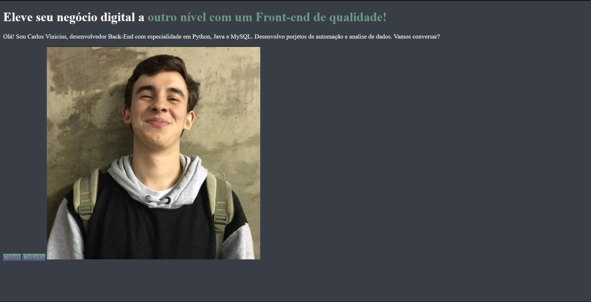

# **🚀Projetos Portfolio**

Reposit[orio cirado para desenvolvimento de um projeto feito durante a formação Iniciante em Programação, onde procuro desenvolver cada dia mais minha lógica de programação e o raciocínio

## **HTML e CSS: ambientes de desenvolvimento, estrutura de arquivos e tags**

- [HTML e CSS: ambientes de desenvolvimento, estrutura de arquivos e tags](https://github.com/carlosvinicius-ai/AluraCurso-Front-End/tree/master/ProjetoPortfolio)

Primeira parte do desenvolvimento, onde entendi mais sobre as utilização de tags semânticas e padronização de processos

