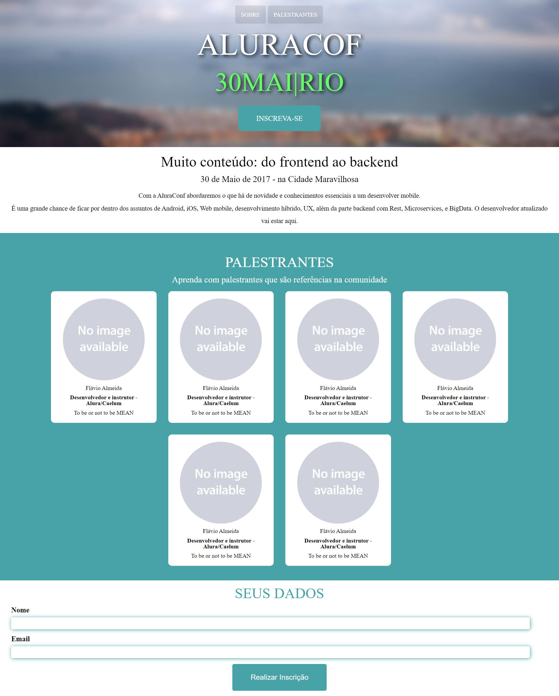

# Alura || Aluraconf || <a href="https://aluraconf-carlos-vinicius.vercel.app">Clique Aqui</a> 

## Technologies Used 🧩

*       

> É para a confraternização da Alura, e também para melhor aprendizado da utilização de Design responsivo e utilização do Javascript  

Feito com **💜** por <a href="https://www.linkedin.com/in/carlosvini/">Carlos Vinícius</a>