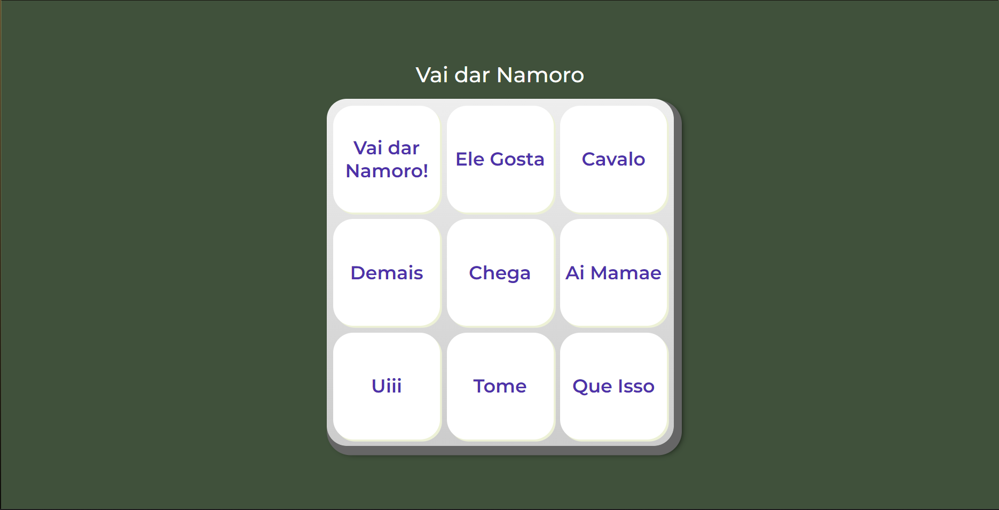

# **🚀Projetos Portfolio**

Repositório cirado para desenvolvimento de um projeto feito durante a formação Iniciante em Programação, onde procuro desenvolver cada dia mais minha lógica de programação e o raciocínio utilizando a liguagem JavaScript como base

## Technologies Used 🧩

*     

## **AluraMidi - Vai dar Namoro**

- [AluraMidi - Vai dar Namoro](https://github.com/carlosvinicius-ai/AluraCurso-Front-End/tree/master/aluramidi/AluraMidi)
- [Site](https://github.com/carlosvinicius-ai/AluraCurso-Front-End/aluramidi/AluraMidi)

Projeto finalizado, onde pude desenvolver a lógica de programação com um desafio muito intuito

